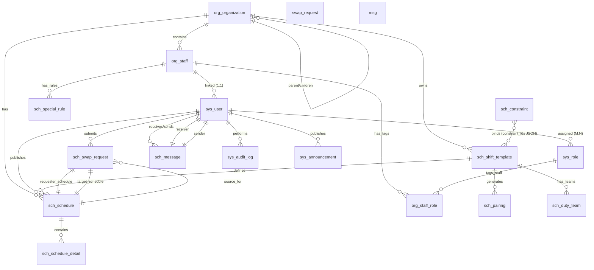

# 数据库设计文档

**文档版本：** V1.0
**最后更新：** 2026-07-10
**维护者：** 开发团队

---

## 1. 数据库概述

| 项目 | 说明 |
|------|------|
| 数据库名 | `scp_db` |
| 数据库类型 | PostgreSQL 15+ |
| 连接方式 | asyncpg（SQLAlchemy async） |
| 字符集 | UTF-8 |
| ORM | SQLAlchemy 2.0 (声明式) |
| 迁移工具 | Alembic + 启动时自动迁移 |
| 事务策略 | **不自动 commit**，每个 Service 独立管理事务边界 |

---

## 2. ER 关系图



---

## 3. 表清单

### 3.1 组织架构模块 (`org_`)

| 表名 | 用途 | 行数估算 |
|------|------|---------|
| `org_organization` | 组织架构树（支持多级部门） | 动态 |
| `org_staff` | 人员信息 | 动态 |
| `org_staff_role` | 人员标识关联（标签/身份标记） | 动态 |

### 3.2 系统模块 (`sys_`)

| 表名 | 用途 | 行数估算 |
|------|------|---------|
| `sys_user` | 系统用户（登录账号） | 动态 |
| `sys_role` | 角色定义（含权限配置） | 4+自定义 |
| `sys_user_role` | 用户角色关联（多对多） | 动态 |
| `sys_config` | 系统配置键值对 | 5-20 |
| `sys_audit_log` | 操作日志 | 累积增长 |
| `sys_message` | 系统消息通知 | 累积增长 |
| `sys_announcement` | 公告 | 动态 |

### 3.3 排班模块 (`sch_`)

| 表名 | 用途 | 行数估算 |
|------|------|---------|
| `sch_shift_template` | 班次模板 | 10-50 |
| `sch_constraint` | 约束规则 | 10-30 |
| `sch_special_rule` | 特殊排班规则 | 动态 |
| `sch_schedule` | 排班记录（按日期+班次） | 人员数 × 天数 |
| `sch_schedule_detail` | 排班明细（每班人员列表） | 排班数 × 人数 |
| `sch_pairing` | 配对关系（跨月新老员工配对） | 动态 |
| `sch_duty_team` | 值班组（按组排班） | 动态 |

### 3.4 调班模块 (`swap_`)

| 表名 | 用途 | 行数估算 |
|------|------|---------|
| `sch_swap_request` | 调班申请 | 动态 |

### 3.5 导出模块 (`exp_`)

| 表名 | 用途 | 行数估算 |
|------|------|---------|
| `exp_export_template` | 自定义导出模板 | 动态 |

---

## 4. 核心表详细设计

### 4.1 组织架构

#### `org_organization` — 组织架构表

```sql
CREATE TABLE org_organization (
    id          SERIAL PRIMARY KEY,
    name        VARCHAR(100) NOT NULL,           -- 组织名称
    parent_id   INT REFERENCES org_organization(id),  -- 上级组织ID
    level       SMALLINT DEFAULT 1,              -- 层级深度
    sort_order  INT DEFAULT 0,                   -- 同级排序序号
    code        VARCHAR(50) UNIQUE,              -- 部门代码
    status      SMALLINT DEFAULT 1,              -- 0=停用 1=启用
    daily_max_scheduled_ratio NUMERIC(3,2),       -- 每日排班人数上限比例
    created_at  TIMESTAMPTZ DEFAULT NOW(),
    updated_at  TIMESTAMPTZ DEFAULT NOW()
);
```

| 字段 | 类型 | 约束 | 说明 |
|------|------|------|------|
| id | INTEGER | PK, AUTO | 主键 |
| name | VARCHAR(100) | NOT NULL | 组织名称 |
| parent_id | INTEGER | FK → self | 上级组织（自引用实现树形结构） |
| level | SMALLINT | DEFAULT 1 | 层级深度 |
| sort_order | INTEGER | DEFAULT 0 | 同级排序序号 |
| code | VARCHAR(50) | UNIQUE, INDEX | 部门代码（自动生成，可编辑） |
| status | SMALLINT | DEFAULT 1 | 0=停用 1=启用 |
| daily_max_scheduled_ratio | NUMERIC(3,2) | NULL | 每日排班人数上限比例（如 0.70=70%），NULL 则使用全局默认 |
| created_at | TIMESTAMPTZ | DEFAULT NOW() | 创建时间 |
| updated_at | TIMESTAMPTZ | DEFAULT NOW() | 更新时间 |

**索引：**
- `IX org_organization.parent_id` — 父节点查询优化
- `UQ org_organization.code` — 代码唯一性

---

#### `org_staff` — 人员信息表

```sql
CREATE TABLE org_staff (
    id          SERIAL PRIMARY KEY,
    name        VARCHAR(50) NOT NULL,            -- 姓名
    employee_no VARCHAR(30) UNIQUE NOT NULL,     -- 工号
    phone       VARCHAR(20),                     -- 联系电话
    org_id      INT NOT NULL REFERENCES org_organization(id),
    status      SMALLINT DEFAULT 1,              -- 1=在岗 2=请假 3=外派 0=停用
    tags        JSON,                            -- 特殊角色标签 ["带班领导","新入职"]
    available_posts JSON,                        -- 可用岗位列表
    created_at  TIMESTAMPTZ DEFAULT NOW(),
    updated_at  TIMESTAMPTZ DEFAULT NOW()
);
```

| 字段 | 类型 | 约束 | 说明 |
|------|------|------|------|
| id | INTEGER | PK, AUTO | 主键 |
| name | VARCHAR(50) | NOT NULL | 姓名 |
| employee_no | VARCHAR(30) | UNIQUE, NOT NULL | 工号 |
| phone | VARCHAR(20) | NULL | 联系电话 |
| org_id | INTEGER | FK, INDEX, NOT NULL | 所属组织 |
| status | SMALLINT | DEFAULT 1 | 1=在岗 2=请假 3=外派 0=停用 |
| tags | JSON | NULL | 特殊角色标签数组 |
| available_posts | JSON | NULL | 可用岗位列表数组 |
| created_at | TIMESTAMPTZ | DEFAULT NOW() | 创建时间 |
| updated_at | TIMESTAMPTZ | DEFAULT NOW() | 更新时间 |

**索引：**
- `IX org_staff.employee_no` — 工号唯一查询
- `IX org_staff.org_id` — 按组织筛选

---

#### `org_staff_role` — 人员标识关联表

```sql
CREATE TABLE org_staff_role (
    id        SERIAL PRIMARY KEY,
    staff_id  INT NOT NULL REFERENCES org_staff(id) ON DELETE CASCADE,
    role_id   INT NOT NULL REFERENCES sys_role(id) ON DELETE CASCADE
);
```

| 字段 | 类型 | 约束 | 说明 |
|------|------|------|------|
| id | INTEGER | PK, AUTO | 主键 |
| staff_id | INTEGER | FK, INDEX, NOT NULL | 人员 ID |
| role_id | INTEGER | FK, NOT NULL | 标识角色 ID |

> **注意：** 此表无 SQLAlchemy relationship，全部手动查询。用于人员身份标记（非 RBAC），与 `sys_role` 共享角色表但语义不同。

---

### 4.2 系统模块

#### `sys_user` — 系统用户表

```sql
CREATE TABLE sys_user (
    id                    SERIAL PRIMARY KEY,
    username              VARCHAR(50) UNIQUE NOT NULL,
    password_hash         VARCHAR(128) NOT NULL,
    staff_id              INT REFERENCES org_staff(id),
    status                SMALLINT DEFAULT 1,
    must_change_password  BOOLEAN DEFAULT FALSE,
    last_login_at         TIMESTAMPTZ,
    created_at            TIMESTAMPTZ DEFAULT NOW(),
    updated_at            TIMESTAMPTZ DEFAULT NOW()
);
```

| 字段 | 类型 | 约束 | 说明 |
|------|------|------|------|
| id | INTEGER | PK, AUTO | 主键 |
| username | VARCHAR(50) | UNIQUE, INDEX, NOT NULL | 登录用户名 |
| password_hash | VARCHAR(128) | NOT NULL | bcrypt 加密密码 |
| staff_id | INTEGER | FK → org_staff.id, NULL | 关联人员（可选） |
| status | SMALLINT | DEFAULT 1 | 0=禁用 1=启用 |
| must_change_password | BOOLEAN | DEFAULT FALSE | 首次登录必须修改密码 |
| last_login_at | TIMESTAMPTZ | NULL | 最后登录时间 |
| created_at | TIMESTAMPTZ | DEFAULT NOW() | 创建时间 |
| updated_at | TIMESTAMPTZ | DEFAULT NOW() | 更新时间 |

**索引：**
- `UQ sys_user.username` — 用户名唯一
- `IX sys_user.username` — 登录查询

---

#### `sys_role` — 角色表

```sql
CREATE TABLE sys_role (
    id          SERIAL PRIMARY KEY,
    name        VARCHAR(50) NOT NULL,
    code        VARCHAR(30) UNIQUE NOT NULL,
    role_type   VARCHAR(10) DEFAULT 'role',
    permissions JSON,
    is_system   BOOLEAN DEFAULT FALSE,
    created_at  TIMESTAMPTZ DEFAULT NOW()
);
```

| 字段 | 类型 | 约束 | 说明 |
|------|------|------|------|
| id | INTEGER | PK, AUTO | 主键 |
| name | VARCHAR(50) | NOT NULL | 角色名称 |
| code | VARCHAR(30) | UNIQUE, NOT NULL | 角色编码 |
| role_type | VARCHAR(10) | DEFAULT 'role' | role=角色(有权限) tag=标识(仅标记人员) |
| permissions | JSON | NULL | 权限列表 `{"module": ["action1", "action2"]}` |
| is_system | BOOLEAN | DEFAULT FALSE | 是否系统内置角色（不可删除） |
| created_at | TIMESTAMPTZ | DEFAULT NOW() | 创建时间 |

**预置角色：**

| code | name | role_type | 权限范围 |
|------|------|-----------|---------|
| admin | 超级管理员 | role | 全部权限 |
| scheduler | 排班管理员 | role | 排班/配置/导入导出 |
| leader | 组长 | role | 本组排班/审批/查看 |
| member | 普通队员 | role | 个人排班/查看/申请调班 |

---

#### `sys_user_role` — 用户角色关联表

```sql
CREATE TABLE sys_user_role (
    id        SERIAL PRIMARY KEY,
    user_id   INT NOT NULL REFERENCES sys_user(id) ON DELETE CASCADE,
    role_id   INT NOT NULL REFERENCES sys_role(id) ON DELETE CASCADE
);
```

---

#### `sys_config` — 系统配置表

```sql
CREATE TABLE sys_config (
    id           SERIAL PRIMARY KEY,
    config_key   VARCHAR(100) UNIQUE NOT NULL,
    config_value VARCHAR(1000) NOT NULL,
    description  VARCHAR(200),
    updated_at   TIMESTAMPTZ DEFAULT NOW()
);
```

---

#### `sys_audit_log` — 操作日志表

```sql
CREATE TABLE sys_audit_log (
    id            SERIAL PRIMARY KEY,
    user_id       INT NOT NULL REFERENCES sys_user(id),
    action        VARCHAR(50) NOT NULL,
    target_type   VARCHAR(50) NOT NULL,
    target_id     INT,
    detail        JSON,
    ip_address    VARCHAR(45),
    created_at    TIMESTAMPTZ DEFAULT NOW()
);
```

| 字段 | 类型 | 约束 | 说明 |
|------|------|------|------|
| user_id | INTEGER | FK, INDEX, NOT NULL | 操作人 ID |
| action | VARCHAR(50) | NOT NULL | 操作类型（create/update/delete/publish 等） |
| target_type | VARCHAR(50) | NOT NULL | 操作对象类型（schedule/swap/staff 等） |
| target_id | INTEGER | NULL | 操作对象 ID |
| detail | JSON | NULL | 操作详情快照 |
| ip_address | VARCHAR(45) | NULL | 操作人 IP（IPv6 最大 45 字符） |
| created_at | TIMESTAMPTZ | DEFAULT NOW() | 操作时间 |

---

#### `sys_message` — 系统消息表

```sql
CREATE TABLE sys_message (
    id              SERIAL PRIMARY KEY,
    receiver_id     INT NOT NULL REFERENCES sys_user(id),
    sender_id       INT REFERENCES sys_user(id),
    title           VARCHAR(200) NOT NULL,
    content         TEXT,
    msg_type        VARCHAR(20) NOT NULL DEFAULT 'system',
    is_read         BOOLEAN DEFAULT FALSE,
    read_time       TIMESTAMPTZ,
    relation_type   VARCHAR(30),
    relation_id     INT,
    is_broadcast    BOOLEAN DEFAULT FALSE,
    deleted_at      TIMESTAMPTZ,
    created_at      TIMESTAMPTZ DEFAULT NOW(),
    updated_at      TIMESTAMPTZ DEFAULT NOW()
);
```

| 字段 | 类型 | 约束 | 说明 |
|------|------|------|------|
| receiver_id | INTEGER | FK, INDEX, NOT NULL | 接收人 |
| sender_id | INTEGER | FK → sys_user, NULL | 发送人（系统消息为空） |
| title | VARCHAR(200) | NOT NULL | 消息标题 |
| content | TEXT | NULL | 消息内容 |
| msg_type | VARCHAR(20) | NOT NULL | schedule/swap/approve/system |
| is_read | BOOLEAN | DEFAULT FALSE, INDEX | 是否已读 |
| read_time | TIMESTAMPTZ | NULL | 阅读时间 |
| relation_type | VARCHAR(30) | NULL | 关联业务类型 |
| relation_id | INTEGER | NULL | 关联业务 ID |
| is_broadcast | BOOLEAN | DEFAULT FALSE | 是否广播消息 |
| deleted_at | TIMESTAMPTZ | NULL | 永久隐藏时间（软删除） |
| created_at | TIMESTAMPTZ | DEFAULT NOW() | 创建时间 |
| updated_at | TIMESTAMPTZ | DEFAULT NOW() | 更新时间 |

**复合索引：** `IX sys_message(receiver_id, is_read, created_at)` — 按接收人+已读状态+时间排序查询优化

---

#### `sys_announcement` — 公告表

```sql
CREATE TABLE sys_announcement (
    id             SERIAL PRIMARY KEY,
    title          VARCHAR(200) NOT NULL,
    content        TEXT NOT NULL,
    publisher_id   INT NOT NULL REFERENCES sys_user(id),
    target_scope   VARCHAR(20) DEFAULT 'all',
    target_ids     VARCHAR(500),
    is_active      BOOLEAN DEFAULT TRUE,
    deleted_at     TIMESTAMPTZ,
    created_at     TIMESTAMPTZ DEFAULT NOW(),
    updated_at     TIMESTAMPTZ DEFAULT NOW()
);
```

---

### 4.3 排班模块

#### `sch_shift_template` — 班次模板表

```sql
CREATE TABLE sch_shift_template (
    id                          SERIAL PRIMARY KEY,
    name                        VARCHAR(50) NOT NULL,
    org_id                      INT REFERENCES org_organization(id),
    start_time                  VARCHAR(5) NOT NULL,      -- HH:MM
    end_time                    VARCHAR(5) NOT NULL,
    duration_hours              NUMERIC(4,1) NOT NULL,
    color                       VARCHAR(7) DEFAULT '#409EFF',
    leader_min                  INT DEFAULT 0,
    leader_max                  INT DEFAULT 1,
    leader_pool                 JSON,
    member_min                  INT DEFAULT 1,
    member_max                  INT DEFAULT 3,
    apply_days                  JSON NOT NULL DEFAULT [1,2,3,4,5,6,7],
    status                      SMALLINT DEFAULT 1,
    allow_multi_template        BOOLEAN DEFAULT FALSE,
    leader_enabled              BOOLEAN DEFAULT FALSE,
    leader_rotation_frequency   VARCHAR(20),
    leader_count                INT DEFAULT 1,
    leader_use_tag              BOOLEAN DEFAULT TRUE,
    leader_tag_name             VARCHAR(30),
    member_enabled              BOOLEAN DEFAULT TRUE,
    member_rotation_frequency   VARCHAR(20),
    special_enabled             BOOLEAN DEFAULT FALSE,
    special_rotation_frequency  VARCHAR(20),
    special_count               INT DEFAULT 1,
    special_pool                JSON,
    special_exclude_from_member BOOLEAN DEFAULT TRUE,
    constraint_ids              JSON,
    created_at                  TIMESTAMPTZ DEFAULT NOW(),
    updated_at                  TIMESTAMPTZ DEFAULT NOW()
);
```

| 字段 | 类型 | 约束 | 说明 |
|------|------|------|------|
| id | INTEGER | PK, AUTO | 主键 |
| name | VARCHAR(50) | NOT NULL | 班次名称 |
| org_id | INTEGER | FK, NULL | 所属组织（NULL=全局） |
| start_time | VARCHAR(5) | NOT NULL | 起始时间 HH:MM |
| end_time | VARCHAR(5) | NOT NULL | 结束时间 HH:MM |
| duration_hours | NUMERIC(4,1) | NOT NULL | 班次时长（小时） |
| color | VARCHAR(7) | DEFAULT '#409EFF' | HEX 颜色标识 |
| leader_min/max | INTEGER | DEFAULT 0/1 | 值班领导最少/最多人数 |
| leader_pool | JSON | NULL | 领导候选人员 ID 列表 |
| member_min/max | INTEGER | DEFAULT 1/3 | 值班人员最少/最多人数 |
| apply_days | JSON | DEFAULT [1..7] | 适用日期（1=周一~7=周日） |
| status | SMALLINT | DEFAULT 1 | 0=停用 1=启用 |
| allow_multi_template | BOOLEAN | DEFAULT FALSE | 是否允许同日参与其他模板 |
| leader_enabled | BOOLEAN | DEFAULT FALSE | 值班领导组开关 |
| leader_rotation_frequency | VARCHAR(20) | NULL | 领导组轮换频次 day/week/month |
| leader_count | INTEGER | DEFAULT 1 | 领导组每次选出人数 |
| leader_use_tag | BOOLEAN | DEFAULT TRUE | 候选池为空时回退到标识人员 |
| leader_tag_name | VARCHAR(30) | NULL | 标识领导的身份标签名 |
| member_enabled | BOOLEAN | DEFAULT TRUE | 值班人员组开关 |
| member_rotation_frequency | VARCHAR(20) | NULL | 人员组轮换频次 |
| special_enabled | BOOLEAN | DEFAULT FALSE | 特殊人员组开关 |
| special_rotation_frequency | VARCHAR(20) | NULL | 特殊组轮换频次 |
| special_count | INTEGER | DEFAULT 1 | 特殊组每次选出人数 |
| special_pool | JSON | NULL | 特殊人员候选 ID 列表 |
| special_exclude_from_member | BOOLEAN | DEFAULT TRUE | 特殊人员是否从值班人员池排除 |
| constraint_ids | JSON | NULL | 关联约束规则 ID 列表（NULL=使用全部） |

---

#### `sch_constraint` — 约束规则表

```sql
CREATE TABLE sch_constraint (
    id          SERIAL PRIMARY KEY,
    rule_type   VARCHAR(50) NOT NULL,
    rule_name   VARCHAR(100) NOT NULL,
    params      JSON NOT NULL,
    priority    INT DEFAULT 0,
    scope_type  VARCHAR(20) DEFAULT 'all',
    scope_ids   JSON,
    enabled     BOOLEAN DEFAULT TRUE,
    is_preset   BOOLEAN DEFAULT FALSE,
    created_at  TIMESTAMPTZ DEFAULT NOW(),
    updated_at  TIMESTAMPTZ DEFAULT NOW()
);
```

| 字段 | 类型 | 约束 | 说明 |
|------|------|------|------|
| id | INTEGER | PK, AUTO | 主键 |
| rule_type | VARCHAR(50) | NOT NULL | 规则类型编码 |
| rule_name | VARCHAR(100) | NOT NULL | 规则名称 |
| params | JSON | NOT NULL | 规则参数（结构因类型而异） |
| priority | INTEGER | DEFAULT 0 | 优先级（数字越小越优先） |
| scope_type | VARCHAR(20) | DEFAULT 'all' | all=全局 / org=指定组织 |
| scope_ids | JSON | NULL | 适用范围 ID 列表 |
| enabled | BOOLEAN | DEFAULT TRUE | 是否启用 |
| is_preset | BOOLEAN | DEFAULT FALSE | 是否系统预置（预置规则不可删除） |
| created_at | TIMESTAMPTZ | DEFAULT NOW() | 创建时间 |
| updated_at | TIMESTAMPTZ | DEFAULT NOW() | 更新时间 |

**预置规则类型：**

| rule_type | rule_name | params 示例 |
|-----------|-----------|------------|
| MAX_CONTINUOUS_DAYS | 连续工作上限 | `{"max_days": 5}` |
| MIN_REST_AFTER_CONTINUOUS | 连续工作后最少休息 | `{"rest_days": 1}` |
| MIN_SHIFT_INTERVAL | 班次最少间隔 | `{"hours": 8}` |
| MIN_REST_AFTER_NIGHT | 夜班后最少休息 | `{"hours": 12}` |
| MAX_SHIFTS_PER_DAY | 每天最多上班数 | `{"count": 1}` |
| MAX_WEEKLY_HOURS | 每周最多工作时长 | `{"hours": 48}` |
| HOLIDAY_MODE | 节假日排班模式 | `{"mode": "normal"}` |
| WEEKEND_DIFF | 周末差异化 | `{"enabled": false}` |

---

#### `sch_special_rule` — 特殊排班规则表

```sql
CREATE TABLE sch_special_rule (
    id              SERIAL PRIMARY KEY,
    staff_id        INT NOT NULL REFERENCES org_staff(id),
    rule_type       VARCHAR(50) NOT NULL,
    params          JSON,
    effective_from  DATE,
    effective_to    DATE,
    reason          TEXT,
    created_at      TIMESTAMPTZ DEFAULT NOW(),
    updated_at      TIMESTAMPTZ DEFAULT NOW()
);
```

| 字段 | 类型 | 约束 | 说明 |
|------|------|------|------|
| id | INTEGER | PK, AUTO | 主键 |
| staff_id | INTEGER | FK, INDEX, NOT NULL | 关联人员 |
| rule_type | VARCHAR(50) | NOT NULL | 规则类型 |
| params | JSON | NULL | 规则参数 |
| effective_from | DATE | NULL | 生效开始日期 |
| effective_to | DATE | NULL | 生效结束日期 |
| reason | TEXT | NULL | 备注原因 |

**规则类型：**

| rule_type | 说明 | params 示例 |
|-----------|------|------------|
| exclude_shift | 不排某班次 | `{"exclude_shift_ids": [1,3]}` |
| include_shift | 仅排某班次 | `{"include_shift_ids": [1]}` |
| exclude_post | 不排某岗位 | `{"exclude_post_ids": [2]}` |
| must_pair | 必须搭配某人 | `{"must_pair_staff_ids": [5]}` |
| exclude_date | 特定日期不排班 | `{"exclude_dates": ["2026-06-15"]}` |
| exclude_weekday | 特定星期不排某班 | `{"exclude_weekdays": [3], "exclude_shift_ids": [3]}` |

---

#### `sch_schedule` — 排班记录表

```sql
CREATE TABLE sch_schedule (
    id              SERIAL PRIMARY KEY,
    date            DATE NOT NULL,
    shift_id        INT NOT NULL REFERENCES sch_shift_template(id),
    org_id          INT NOT NULL REFERENCES org_organization(id),
    leader_staff_id INT REFERENCES org_staff(id),
    status          SMALLINT DEFAULT 0,
    source          VARCHAR(20) DEFAULT 'manual',
    published_at    TIMESTAMPTZ,
    published_by    INT REFERENCES sys_user(id),
    created_at      TIMESTAMPTZ DEFAULT NOW(),
    updated_at      TIMESTAMPTZ DEFAULT NOW()
);
```

| 字段 | 类型 | 约束 | 说明 |
|------|------|------|------|
| id | INTEGER | PK, AUTO | 主键 |
| date | DATE | INDEX, NOT NULL | 排班日期 |
| shift_id | INTEGER | FK, NOT NULL | 班次模板 ID |
| org_id | INTEGER | FK, INDEX, NOT NULL | 组织 ID |
| leader_staff_id | INTEGER | FK → org_staff, NULL | 值班领导人员 ID |
| status | SMALLINT | DEFAULT 0 | 0=草稿 1=已发布 2=已撤回 3=待审核 |
| source | VARCHAR(20) | DEFAULT 'manual' | auto=自动 manual=手动 swap=调班 |
| published_at | TIMESTAMPTZ | NULL | 发布时间 |
| published_by | INTEGER | FK → sys_user, NULL | 发布人 ID |
| created_at | TIMESTAMPTZ | DEFAULT NOW() | 创建时间 |
| updated_at | TIMESTAMPTZ | DEFAULT NOW() | 更新时间 |

**状态常量：**

| 值 | 含义 | 可编辑 | 可删除 |
|----|------|--------|--------|
| 0 | 草稿 | ✅ | ✅ |
| 1 | 已发布 | ❌ | ❌ |
| 2 | 已撤回 | ✅ | ✅ |
| 3 | 待审核 | ❌ | ❌ |

---

#### `sch_schedule_detail` — 排班明细表

```sql
CREATE TABLE sch_schedule_detail (
    id              SERIAL PRIMARY KEY,
    schedule_id     INT NOT NULL REFERENCES sch_schedule(id) ON DELETE CASCADE,
    staff_id        INT NOT NULL REFERENCES org_staff(id),
    role_type       VARCHAR(20) NOT NULL,
    is_substitute   BOOLEAN DEFAULT FALSE,
    note            VARCHAR(200),
    created_at      TIMESTAMPTZ DEFAULT NOW(),
    updated_at      TIMESTAMPTZ DEFAULT NOW()
);
```

| 字段 | 类型 | 约束 | 说明 |
|------|------|------|------|
| id | INTEGER | PK, AUTO | 主键 |
| schedule_id | INTEGER | FK, INDEX, NOT NULL, ON DELETE CASCADE | 排班记录 ID |
| staff_id | INTEGER | FK, INDEX, NOT NULL | 人员 ID |
| role_type | VARCHAR(20) | NOT NULL | leader / member |
| is_substitute | BOOLEAN | DEFAULT FALSE | 是否替班标记 |
| note | VARCHAR(200) | NULL | 备注 |

**索引：**
- `IX sch_schedule_detail(schedule_id)` — 查询班次人员
- `IX sch_schedule_detail(staff_id)` — 查询个人排班

---

#### `sch_pairing` — 配对关系表（跨月新老员工配对）

```sql
CREATE TABLE sch_pairing (
    id              SERIAL PRIMARY KEY,
    org_id          INT NOT NULL,
    shift_id        INT NOT NULL,
    slot_index      INT NOT NULL,
    group_type      VARCHAR(10) NOT NULL,
    staff_ids       INT[] NOT NULL,
    is_new          BOOLEAN[] NOT NULL,
    created_at      TIMESTAMPTZ DEFAULT NOW(),
    updated_at      TIMESTAMPTZ DEFAULT NOW(),
    CONSTRAINT uq_pairing_slot UNIQUE (org_id, shift_id, slot_index, group_type)
);
```

| 字段 | 类型 | 约束 | 说明 |
|------|------|------|------|
| id | INTEGER | PK, AUTO | 主键 |
| org_id | INTEGER | INDEX, NOT NULL | 组织 ID |
| shift_id | INTEGER | INDEX, NOT NULL | 班次模板 ID |
| slot_index | INTEGER | NOT NULL | 槽位索引 (0/1/2) |
| group_type | VARCHAR(10) | NOT NULL | day / night |
| staff_ids | INT[] | NOT NULL | 配对人员 ID 数组 |
| is_new | BOOLEAN[] | NOT NULL | 是否新员工标记数组 |

**唯一约束：** `uq_pairing_slot` — (org_id, shift_id, slot_index, group_type) 组合唯一

---

#### `sch_duty_team` — 值班组表

```sql
CREATE TABLE sch_duty_team (
    id              SERIAL PRIMARY KEY,
    shift_template_id INT NOT NULL REFERENCES sch_shift_template(id),
    name            VARCHAR(50) NOT NULL,
    staff_ids       TEXT NOT NULL DEFAULT '[]',
    priority        INT DEFAULT 10,
    enabled         SMALLINT DEFAULT 1,
    created_at      TIMESTAMPTZ DEFAULT NOW(),
    updated_at      TIMESTAMPTZ DEFAULT NOW()
);
```

| 字段 | 类型 | 约束 | 说明 |
|------|------|------|------|
| id | INTEGER | PK, AUTO | 主键 |
| shift_template_id | INTEGER | FK, NOT NULL | 所属班次模板 |
| name | VARCHAR(50) | NOT NULL | 值班组名称 |
| staff_ids | TEXT | DEFAULT '[]' | 组内人员 ID 列表（JSON 字符串） |
| priority | INTEGER | DEFAULT 10 | 优先级（数字越小越优先） |
| enabled | SMALLINT | DEFAULT 1 | 是否启用 |

---

### 4.4 调班模块

#### `sch_swap_request` — 调班申请表

```sql
CREATE TABLE sch_swap_request (
    id                      SERIAL PRIMARY KEY,
    request_no              VARCHAR(30) UNIQUE NOT NULL,
    swap_type               VARCHAR(20) NOT NULL,
    requester_id            INT NOT NULL REFERENCES sys_user(id),
    requester_schedule_id   INT NOT NULL REFERENCES sch_schedule(id),
    target_id               INT REFERENCES sys_user(id),
    target_schedule_id      INT REFERENCES sch_schedule(id),
    claimer_id              INT REFERENCES sys_user(id),
    reason                  TEXT,
    status                  VARCHAR(20) DEFAULT 'pending_confirm',
    approved_by             INT REFERENCES sys_user(id),
    approved_at             TIMESTAMPTZ,
    confirmed_at            TIMESTAMPTZ,
    refused_at              TIMESTAMPTZ,
    refuse_comment          TEXT,
    approve_comment         TEXT,
    created_at              TIMESTAMPTZ DEFAULT NOW(),
    updated_at              TIMESTAMPTZ DEFAULT NOW()
);
```

| 字段 | 类型 | 约束 | 说明 |
|------|------|------|------|
| id | INTEGER | PK, AUTO | 主键 |
| request_no | VARCHAR(30) | UNIQUE, INDEX, NOT NULL | 申请编号 |
| swap_type | VARCHAR(20) | NOT NULL | specified=指定换班 / open=开放换班 |
| requester_id | INTEGER | FK, INDEX, NOT NULL | 发起人 ID |
| requester_schedule_id | INTEGER | FK, NOT NULL | 发起人排班记录 ID |
| target_id | INTEGER | FK → sys_user, NULL | 被换人 ID（指定换班时） |
| target_schedule_id | INTEGER | FK → sch_schedule, NULL | 被换人排班记录 ID |
| claimer_id | INTEGER | FK → sys_user, NULL | 认领人 ID（开放换班时） |
| reason | TEXT | NULL | 申请原因 |
| status | VARCHAR(20) | DEFAULT 'pending_confirm' | 当前状态 |
| approved_by | INTEGER | FK, NULL | 审批人 ID |
| approved_at | TIMESTAMPTZ | NULL | 审批时间 |
| confirmed_at | TIMESTAMPTZ | NULL | 对方确认时间 |
| refused_at | TIMESTAMPTZ | NULL | 对方拒绝时间 |
| refuse_comment | TEXT | NULL | 拒绝原因 |
| approve_comment | TEXT | NULL | 审批意见 |

**状态机流转：**

```
指定换班:
  pending_confirm → pending_approve → approved → completed
       ↓                ↓
  cancelled        rejected/cancelled

开放换班:
  pending_claim → pending_approve → approved → completed
       ↓               ↓
  cancelled       rejected/cancelled

审批关闭时:
  pending_confirm → completed (跳过审批)
  pending_claim → completed
```

---

### 4.5 导出模块

#### `exp_export_template` — 导出模板表

```sql
CREATE TABLE exp_export_template (
    id              SERIAL PRIMARY KEY,
    name            VARCHAR(100) NOT NULL,
    file_data       BYTEA NOT NULL,
    is_default      BOOLEAN DEFAULT FALSE,
    description     TEXT,
    created_at      TIMESTAMPTZ DEFAULT NOW(),
    updated_at      TIMESTAMPTZ DEFAULT NOW()
);
```

---

## 5. 索引策略汇总

| 表 | 索引字段 | 类型 | 说明 |
|----|---------|------|------|
| `org_staff` | employee_no | UNIQUE | 工号唯一查询 |
| `org_staff` | org_id | B-Tree | 按组织筛选 |
| `org_organization` | parent_id | B-Tree | 树形结构查询 |
| `org_organization` | code | UNIQUE | 部门代码唯一 |
| `sys_user` | username | UNIQUE, INDEX | 登录查询 |
| `sys_config` | config_key | UNIQUE, INDEX | 配置键查询 |
| `sys_audit_log` | user_id | INDEX | 按用户查日志 |
| `sys_audit_log` | action | INDEX | 按操作类型筛选 |
| `sys_message` | receiver_id + is_read + created_at | COMPOSITE | 收件箱查询优化 |
| `sys_message` | is_read | INDEX | 已读/未读筛选 |
| `sch_schedule` | date | INDEX | 按日期查询 |
| `sch_schedule` | org_id | INDEX | 按组织筛选 |
| `sch_schedule_detail` | schedule_id | INDEX | 班次人员查询 |
| `sch_schedule_detail` | staff_id | INDEX | 个人排班查询 |
| `sch_swap_request` | request_no | UNIQUE, INDEX | 申请编号查询 |
| `sch_swap_request` | requester_id | INDEX | 按发起人筛选 |
| `sch_special_rule` | staff_id | INDEX | 按人员查规则 |
| `sch_pairing` | org_id | INDEX | 按组织加载配对 |
| `sch_pairing` | shift_id | INDEX | 按班次加载配对 |
| `sch_pairing` | uq_pairing_slot | UNIQUE | 槽位唯一约束 |

---

## 6. 数据迁移历史

| 版本 | 日期 | 变更内容 |
|------|------|---------|
| V1 | 2026-05 | 初始 Schema 创建（13 张表） |
| V2 | 2026-06-11 | 排班引擎优化：增加约束校验相关字段 |
| V3 | 2026-06-13 | 排班引擎 V2：新增 `sch_pairing` 配对关系表，调整 `sch_schedule` 结构 |
| V4 | 2026-06-16 | 排班引擎集成：统一班次模板三档人员结构（领导/值班/特殊） |
| V5 | 2026-07-09 | 权限统一：`schedule:import` / `schedule:export` 替代原 `import`/`export` 模块权限 |
