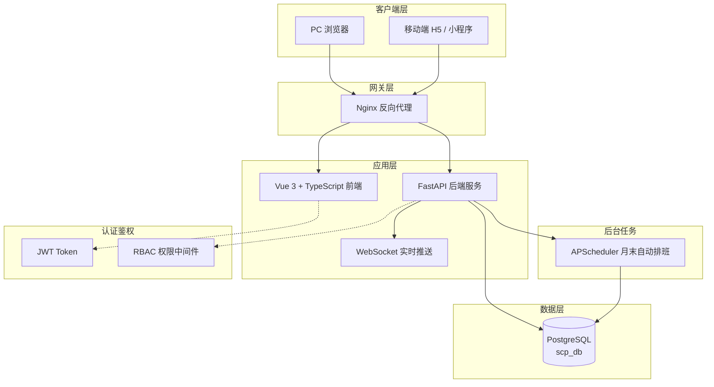

# 系统架构设计文档

**文档版本：** V1.0
**最后更新：** 2026-07-10
**维护者：** 开发团队

---

## 1. 系统概述

排班管理系统（SPS-System, Scheduling Management System）面向 7×24 小时值守场景，提供基于约束的自动排班、调班管理、组织架构层级管理和角色权限控制。

**核心价值：**
- 自动化排班减少人工编排工作量
- 约束规则引擎确保排班合规性
- 灵活的调班流程支持人员变动
- RBAC 权限模型满足多层级组织管理

---

## 2. 技术栈

| 层级 | 技术选型 | 版本 | 选型理由 |
|------|---------|------|---------|
| **后端框架** | FastAPI | 0.109+ | 异步原生、自动 OpenAPI 文档、Pydantic 类型安全 |
| **ORM** | SQLAlchemy | 2.0 (async) | asyncpg 支持、声明式映射、异步会话 |
| **数据库** | PostgreSQL | 15+ | JSON 字段、并发性能、成熟稳定 |
| **迁移工具** | Alembic | 1.13+ | SQLAlchemy 官方迁移工具 |
| **定时任务** | APScheduler | 3.10+ | 异步调度器，月末自动排班检查 |
| **认证** | python-jose + bcrypt | - | JWT 无状态认证、bcrypt 密码哈希 |
| **前端框架** | Vue 3 | 3.x | 组合式 API、响应式系统 |
| **前端语言** | TypeScript | 5.x | 类型安全、IDE 智能提示 |
| **UI 组件库** | Element Plus | 2.x | 中文文档丰富、组件齐全 |
| **状态管理** | Pinia | 2.x | Vue 3 官方推荐、TypeScript 友好 |
| **路由** | Vue Router | 4.x | SPA 路由、导航守卫 |
| **图表** | ECharts | 5.x | 丰富的可视化组件 |
| **HTTP 客户端** | Axios | 1.x | 拦截器、请求取消、响应转换 |
| **构建工具** | Vite | 5.x | 极速 HMR、按需编译 |
| **API 自动导入** | unplugin-auto-import | - | 自动导入 Vue/Element Plus APIs |
| **组件自动注册** | unplugin-vue-components | - | 自动注册 Element Plus 组件 |

---

## 3. 系统架构图



---

## 4. 模块划分

### 4.1 后端模块结构

```
backend/app/
├── main.py                    # FastAPI 应用入口 + 生命周期管理
├── config.py                  # 配置管理（环境变量）
├── database.py                # 数据库连接 + 自动迁移
│
├── api/                       # HTTP 路由层（14 个 Router）
│   ├── auth.py                # 登录/登出/修改密码
│   ├── organization.py        # 组织架构 CRUD
│   ├── staff.py               # 人员管理 CRUD
│   ├── shift_template.py      # 班次模板管理
│   ├── constraint.py          # 约束规则管理
│   ├── special_rule.py        # 特殊排班规则
│   ├── role.py                # 角色权限管理
│   ├── system.py              # 系统配置
│   ├── schedule.py            # 排班管理（手动+自动+发布）
│   ├── swap.py                # 调班管理
│   ├── message.py             # 消息通知 + WebSocket
│   ├── dashboard.py           # 首页看板数据
│   ├── export.py              # 数据导出
│   ├── deps.py                # 依赖注入（认证/权限）
│   └── deps.py                # 公共依赖
│
├── models/                    # 数据模型层（13 张表）
│   ├── base.py                # Base 模型 + 时间戳混入
│   ├── user.py                # sys_user — 系统用户
│   ├── organization.py        # org_organization — 组织架构
│   ├── staff.py               # org_staff — 人员信息
│   ├── shift_template.py      # sch_shift_template — 班次模板
│   ├── constraint.py          # sch_constraint — 约束规则
│   ├── special_rule.py        # sch_special_rule — 特殊规则
│   ├── schedule.py            # sch_schedule — 排班记录
│   ├── pairing.py             # sch_pairing — 配对关系（跨月）
│   ├── duty_team.py           # sch_duty_team — 值班组
│   ├── swap.py                # swap_request — 调班申请
│   ├── message.py             # msg_message — 消息通知
│   ├── export_template.py     # exp_export_template — 导出模板
│   ├── audit_log.py           # sys_audit_log — 操作日志
│   └── __init__.py
│
├── schemas/                   # Pydantic 请求/响应模型
│
├── services/                  # 业务逻辑层（10 个 Service）
│   ├── schedule_service.py    # 排班核心服务
│   ├── schedule_import_service.py # 排班导入服务
│   ├── shift_template_service.py
│   ├── constraint_service.py
│   ├── special_rule_service.py
│   ├── swap_service.py
│   ├── message_service.py
│   ├── dashboard_service.py
│   ├── export_service.py
│   ├── role_service.py
│   ├── auto_schedule_job.py   # 月末自动排班 Job
│   └── notification.py        # 通知推送
│
├── engine/                    # 排班算法引擎（纯领域逻辑）
│   ├── scheduler.py           # 槽位轮换排班引擎
│   ├── constraint_checker.py  # 候选者过滤器
│   ├── scoring.py             # 公平性打分
│   ├── pairing_manager.py     # 配对管理器
│   └── models.py              # 引擎内部数据模型
│
└── utils/                     # 通用工具
    └── init_data.py           # 默认数据初始化
```

### 4.2 前端模块结构

```
frontend/src/
├── main.ts                    # 应用入口
├── App.vue                    # 根组件
├── router/index.ts            # 路由配置 + 导航守卫
├── api/                       # API 封装层（14 个模块）
│   ├── index.ts               # Axios 实例 + 拦截器
│   ├── auth.ts
│   ├── organization.ts
│   ├── staff.ts
│   ├── shift-template.ts
│   ├── constraint.ts
│   ├── special-rule.ts
│   ├── role.ts
│   ├── system.ts
│   ├── schedule.ts
│   ├── swap.ts
│   ├── message.ts
│   ├── dashboard.ts
│   └── export.ts
├── stores/                    # Pinia 状态管理
│   ├── auth.ts                # 认证状态
│   └── system.ts              # 系统配置状态
├── layouts/                   # 布局组件
│   └── MainLayout.vue         # 侧边栏 + 顶栏主布局
├── views/                     # 页面级组件
│   ├── login/LoginView.vue    # 登录页
│   ├── dashboard/DashboardView.vue  # 工作台
│   ├── organization/OrgView.vue       # 组织架构
│   ├── staff/StaffView.vue            # 人员管理
│   ├── shift-template/ShiftTemplateView.vue  # 班次模板
│   ├── constraint/ConstraintView.vue  # 排班规则
│   ├── role/RoleView.vue              # 角色权限
│   ├── system/SystemView.vue          # 系统配置
│   ├── schedule/ScheduleCalendarView.vue  # 排班日历
│   │   └── components/                  # 排班子组件
│   │       ├── CalendarGrid.vue
│   │       ├── ShiftCell.vue
│   │       ├── ShiftDetailDrawer.vue
│   │       ├── StaffSelector.vue
│   │       ├── StatisticsPanel.vue
│   │       └── ExportDialog.vue
│   ├── swap/SwapView.vue              # 调班管理
│   │   └── components/
│   │       ├── SwapRequestForm.vue
│   │       ├── SwapDetailPanel.vue
│   │       └── SwapRecordTable.vue
│   ├── message/MessageView.vue        # 消息中心
│   │   └── components/
│   │       ├── MessageList.vue
│   │       ├── MessageDetailDrawer.vue
│   │       └── AnnouncementSection.vue
│   └── staff/components/
│       ├── AccountDrawer.vue
│       └── SpecialRuleDrawer.vue
└── utils/                     # 工具函数
```

---

## 5. 数据流说明

### 5.1 典型请求链路

```
用户操作 → Vue 组件
    ↓
Pinia Store (状态管理)
    ↓
Axios HTTP 请求 (自动附加 Bearer Token)
    ↓
Nginx 反向代理 (/api/ → 8000)
    ↓
FastAPI 路由层 (deps.get_current_user 验证 JWT)
    ↓
RBAC 权限校验 (require_roles / require_permissions)
    ↓
Service 业务逻辑层
    ↓
Engine 排班算法引擎（纯领域逻辑，零框架依赖）
    ↓
SQLAlchemy ORM → PostgreSQL
    ↓
响应逐层返回 → 前端渲染
```

### 5.2 认证流程

```
1. 用户提交用户名/密码 → POST /api/auth/login
2. 后端验证 → 签发 JWT (access_token + expires_in)
3. 前端存储 token 到 localStorage
4. 后续请求 Axios 拦截器自动附加: Authorization: Bearer <token>
5. 后端 deps.py 解析 JWT → 获取当前用户
6. 路由级权限校验: meta.permission / meta.roles
7. 401 → 跳转登录页; 403 → 跳转工作台（无权限）
```

### 5.3 事务管理

> **重要变更：** `get_db()` 不再自动 commit，事务边界由每个 Service 独立管理。

```python
# Service 层示例
async def create_schedule(factory: SessionFactory, ...) -> SchSchedule:
    async with factory() as db:
        try:
            record = SchSchedule(...)
            db.add(record)
            await db.commit()
            return record
        except Exception:
            await db.rollback()
            raise
```

### 5.4 自动排班调度

```
APScheduler (每 5 分钟检查)
    ↓
auto_schedule_job.run_monthly_auto_schedule()
    ↓
判断条件:
  - 是否月末最后一天?（下月第一天减一天）
  - 当前时间是否在配置的触发窗口内?（配置时间 ±30 分钟）
  - 今天是否已执行过?（auto_schedule_last_run 配置项）
    ↓ (全部满足)
调度引擎 scheduler.py
  - 加载班次模板 + 约束规则 + 特殊规则
  - 槽位轮换算法生成排班
  - 跨月配对关系加载（sch_pairing）
    ↓
写入 sch_schedule 表（草稿状态）
```

---

## 6. 关键设计决策记录

| 决策 | 日期 | 背景 | 方案 | 理由 |
|------|------|------|------|------|
| 事务边界管理 | 2026-06 | `get_db()` 默认 auto-commit 导致嵌套事务问题 | 每个 Service 独立管理事务生命周期 | 细粒度控制、支持嵌套事务、异常时明确回滚 |
| 排班算法模型 | 2026-06 | 传统贪婪算法 vs 槽位轮换模型 | 槽位轮换（Slot-based Rotation） | 公平性更好、天然支持跨月、配对关系可持久化 |
| 前后端 API 同步 | 2026-06 | 新增接口需同时更新前后端 | 约定大于配置：API 文件与 Router 一一对应 | 保持 `frontend/src/api/*.ts` 与 `backend/app/api/*.py` 命名一致 |
| 权限模型 | 2026-06 | 简单角色 vs 模块化权限 | RBAC + 模块×操作权限矩阵 | 支持细粒度控制（如 schedule:import/export） |
| 引擎解耦 | 2026-06 | 排班算法不应耦合 FastAPI | 纯 Python 领域逻辑，零框架依赖 | 便于单元测试、独立演进 |
| 自动导入 | 2026-06 | 每个组件手动导入 Vue/Element Plus API | unplugin-auto-import + unplugin-vue-components | 减少样板代码、统一风格 |
| 路由懒加载 | 2026-06 | 首屏性能优化 | 所有视图组件使用 `() => import()` | 减小初始包体积 |
| 自动排班调度 | 2026-07-11 | APScheduler 检查间隔从 30 分钟改为 5 分钟，增加防重复执行机制 |

---

## 7. 部署拓扑

```
Internet
    │
    ▼
┌─────────────┐
│    Nginx    │  反向代理 + 静态文件 + WebSocket 升级
│  :80 / :443 │
└──────┬──────┘
       │
       ├──────────────────┬──────────────────┐
       ▼                  ▼                  ▼
  /api/*          /* (静态文件)      /ws/* (WebSocket)
       │                  │                  │
       ▼                  ▼                  ▼
  FastAPI :8000      Vue 3 dist/       FastAPI WS Endpoint
  (uvicorn x4)       (index.html)      (WebSocket)
       │
       ▼
  PostgreSQL :5432
  (scp_db)
```

---

## 8. 模块依赖关系

```
依赖方向: API → Service → Engine / Models → Database

不依赖:
- engine/ 不依赖任何 FastAPI/SQLAlchemy 组件
- schemas/ 仅依赖 Pydantic
- utils/init_data.py 仅依赖 models + SQLAlchemy

循环依赖检查:
- api/ → services/ → models/ ✓ (单向)
- services/ → engine/ ✓ (单向)
- frontend/api/ → backend/app/api/ ✗ (无直接依赖，通过 HTTP)
```

---

## 9. 扩展性说明

### 9.1 新增模块的标准步骤

1. **后端：**
   - `models/` 新建模型文件 + `__init__.py` 导出
   - `schemas/` 新建 Pydantic 模型
   - `api/` 新建 Router 并注册到 `main.py`
   - `services/` 新建业务逻辑服务

2. **前端：**
   - `api/` 新建 API 封装文件（命名与后端对应）
   - `views/` 新建页面组件及子组件目录
   - `router/index.ts` 添加路由记录
   - `stores/` 如有需要新建状态管理

3. **权限：**
   - `sys_role` 中分配新模块的权限标识
   - 路由 `meta.permission` 声明所需权限

### 9.2 横向扩展能力

- **后端：** uvicorn workers 支持多进程，可水平扩展
- **WebSocket：** 当前为单节点模式，多节点需引入 Redis Pub/Sub
- **数据库：** 支持读写分离（PostgreSQL Streaming Replication）
